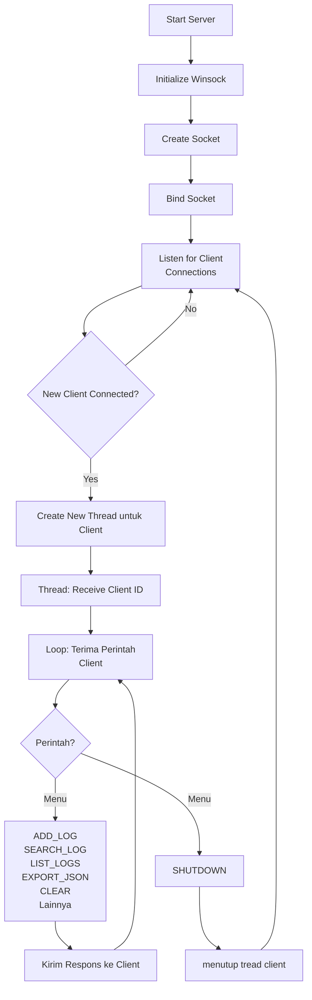
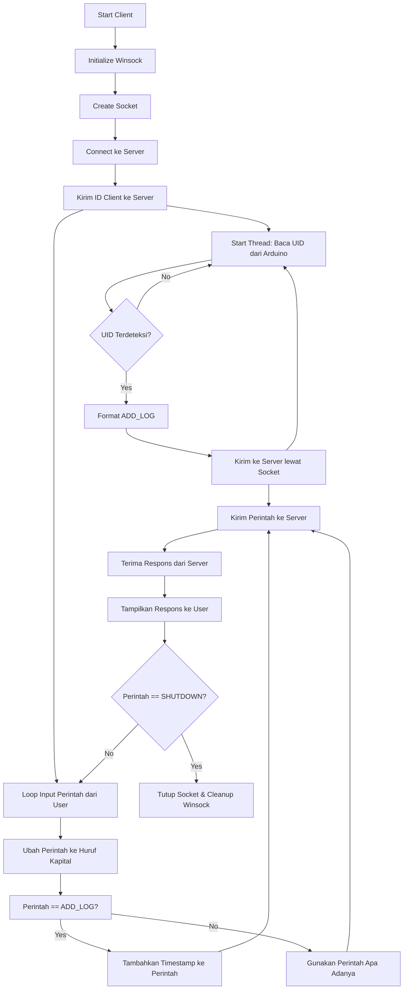

# Dokumentasi Kode Sistem Pencatatan Kehadiran Lab dengan RFID

## Deskripsi Sistem

Sistem ini terdiri dari dua bagian utama: **Server** dan **Client**. Server bertugas menerima dan memproses data log pemindaian RFID dari beberapa client secara real-time menggunakan socket TCP dan multithreading. Client bertugas mengirimkan perintah (request) ke server dan menampilkan respons dari server kepada user.
Sistem ini merupakan implementasi arsitektur **Client-Server TCP** yang berfungsi untuk mencatat, menyimpan, mencari, dan mengekspor data kehadiran kelas menggunakan **RFID**. Sistem terdiri atas dua komponen utama:

- **Server multithreaded** berbasis C++ dan Winsock
-  **Client TCP** yang mendukung interaksi pengguna secara real-time dan bersifat multithreaded (dapat berjalan bersamaan dengan klien lain)

---

## Tujuan

- Menyediakan **komunikasi dua arah** antara client RFID dan server pusat.
- Menyimpan **log kehadiran** lengkap dengan timestamp.
- Mendukung fitur **pencarian**, **pengurutan**,  **ekspor** data ke **JSON**, dan lainnya.
- Melatih penggunaan **socket programming**, **multithreading**, dan **manajemen file** di C++.

---

## 1. Struktur Kode Server

### Header dan Library yang Digunakan

- `<iostream>`, `<string>`, `<sstream>`, `<vector>`, `<fstream>`: untuk I/O, manipulasi string, penyimpanan data, dan file.
- `<cctype>`, `<algorithm>`: untuk manipulasi karakter dan algoritma.
- `<thread>`: untuk multithreading agar server bisa melayani banyak client secara paralel.
- `<winsock2.h>`: untuk socket programming di Windows.
- `"json.hpp"`: library nlohmann JSON untuk serialisasi/deserialisasi data JSON.

---

###  Fungsi Utility

 `toUpper(string str)`

- Mengubah string input menjadi huruf kapital seluruhnya.
- Berguna untuk memudahkan pencocokan perintah tanpa case sensitive.

`getDate()`

- Mengembalikan tanggal hari ini dalam format string, misalnya `2025-05-29`.

 `templateLog()` dan `templateDatabase()`

- Menghasilkan header string tabel untuk tampilan list log dan database user yang ditampilkan ke client.

---

###  Class `Log`

Merepresentasikan  entri log pemindaian RFID.

**Atribut**

- `string RFID` — nomor RFID.
- `string time` — waktu pemindaian.
- `string name` — nama user pemilik RFID.
- `string action` — aksi yang terjadi (misal "IN", "OUT").

**Method**

- Konstruktor default dan konstruktor yang menerima string data.
- Getter untuk tiap atribut.
- `toString()` — mengembalikan representasi string satu baris log.
- Fungsi friend `to_json()` dan `from_json()` untuk konversi ke/dari JSON.

---

###  Class `User`

Merepresentasikan data user yang terdaftar.

 **Atribut**

- `string name` — nama user.
- `string RFID` — nomor RFID user.

**Method**

- Konstruktor default dan konstruktor dengan parameter nama dan RFID.
- Getter atribut.
- `toString()` — representasi string user.
- Fungsi friend `to_json()` dan `from_json()` untuk JSON.

---

###  Class `LogManager`

Pengelola utama data log dan database user.

**Atribut**

- `vector<Log> logs` — menyimpan semua log yang diterima.
- `vector<User> datas` — menyimpan database user.
- `string ID_client` — ID client yang sedang terhubung (optional untuk logging).
- `unordered_map<string, string> lastActionByRFID` — menyimpan aksi terakhir tiap RFID.
- `unordered_map<string, string> rfidToName` — peta RFID ke nama user.

**Method Umum**

- `loadAction()` — memuat aksi terakhir dari tiap RFID berdasarkan logs.
- `insertionSort(vector<Log>& listLog)` — mengurutkan log berdasarkan waktu menggunakan insertion sort.
- `exportBiner(string datasLog, const char nameFile[])` — menambah data ke file biner.
- `loadFileBinery(const char nameFile[])` — membaca data log dari file biner.
- `SearchRFID(string rfid)` — mencari nama user berdasarkan RFID.
- `readFromJSON(vector<User>& db)` — membaca database user dari file JSON.
- `exportToJSON(const vector<Log>& logs, const string& filename)` — menyimpan logs ke file JSON.

**Method Menu** 
(Dipanggil saat menerima perintah client)

- `addLog(string datasLog)` — menambahkan log baru, menyesuaikan data nama dan action. Menggunakkan `exportBiner()`,`loadAction()`,dan `SearchRFID()`
- `searchLogs(string param)` — mencari log berdasarkan RFID atau nama, atau list log hari ini. 
- `listLogs()` — menampilkan semua log yang sudah terurut.`insertionSort()`
- `exportJSON()` — menyimpan log saat ini ke file JSON.
- `database()` — menampilkan list database user.
- `clear()` — menghapus semua log saat ini.
- `help()` — menampilkan daftar perintah yang dapat dipakai client.

**Fucntion `processRequest(string recvMessage)`**

- Fungsi utama yang memproses perintah dari client.
- Memecah `recvMessage` menjadi `request` dan `param`.
- Memanggil fungsi menu sesuai perintah.
- Mengembalikan string hasil proses sebagai response ke client.

---

###  Class `AttendanceSystem`

Server utama yang menangani koneksi client dan menjalankan multithreading.

**Method**

- `clientPort(SOCKET client_socket)`
  - Fungsi yang dijalankan pada tiap thread client.
  - Menerima ID client pertama kali.
  - Loop menerima pesan (request) dari client.
  - Memproses request menggunakan objek `LogManager`.
  - Memanggil `processRequest()`
  - Mengirimkan hasil ke client.
  - Menutup koneksi saat client disconnect atau perintah `SHUTDOWN`.

- `makeSocket()`
  - Membuat socket server TCP pada port 8888.
  - Melakukan bind dan listen.
  - Mengembalikan `SOCKET` hasil pembuatan.

- `ServerProses()` 
  - membuat Socket dengan `makeSocket()`
  - Menjalankan server  dan standby untuk menerima koneksi client.
  - Untuk setiap client baru, buat thread baru menjalankan `clientPort()`.
  - Mendukung multithreading agar server dapat melayani banyak client bersamaan.

---

###  Fungsi `main()`

- Membuat objek `AttendanceSystem`.
- Memanggil `ServerProses()` untuk menjalankan server.

---

## 2. Struktur Kode Client

### Fungsi Utama

* Membuat koneksi TCP ke server
* Mengirim ID client sebagai identifikasi awal
* Mengirim perintah user ke server secara interaktif
* Menerima dan menampilkan respons dari server
* Mendukung perintah `ADD_LOG` dengan timestamp otomatis

### Struktur Kode
- `openSerialPort(const char* portName)`
  - Membuka koneksi ke port serial (`COMxx`) menggunakan `CreateFileA`.
  - Mengatur parameter komunikasi serial:
    - Baud rate: 9600
    - Byte size: 8
    - Stop bit: 1
    - Parity: none
  - Mengatur timeout pembacaan serial melalui `SetCommTimeouts`.
  - Mengembalikan `HANDLE` port jika sukses, atau `INVALID_HANDLE_VALUE` jika gagal.

-  `readUIDFromArduino(SOCKET server_socket)`
   - Membuka koneksi ke Arduino melalui `openSerialPort()`.
   - Loop berjalan selama `keepReading == true`.
   - Membaca data dari Arduino menggunakan `ReadFile()`.
   - Membersihkan karakter `\r` dan `\n` dari UID.
   - Jika UID valid:
     - Format pesan: `ADD_LOG <uid> <timestamp>`
     - Kirim ke server melalui socket (`send()`).
   - Delay 300ms antar pembacaan data serial.
   - Menutup port serial setelah selesai (`CloseHandle()`).
  
- `clientInitial()`
  - Inisialisasi Winsock.
  - Membuat socket.
  - Melakukan koneksi ke server menggunakan IP dan port yang sudah didefinisikan.
  - Mengirim ID client ke server.
  - Memulai proses utama interaktif `clientMainProses()`.
  - Menutup koneksi dan membersihkan Winsock.

- `clientMainProses()`
  - Menerima pesan sambutan dari server.
  - Loop menerima input perintah dari user.
  - Mengubah perintah menjadi huruf kapital.
  - Jika perintah `ADD_LOG`, tambahkan waktu saat ini sebagai parameter.
  - Mengirim perintah ke server.
  - Menerima dan menampilkan respons server.
  - Jika perintah `SHUTDOWN`, keluar dari loop dan program berakhir.

- `getCurrentTime()`
  - Mendapatkan waktu saat ini dalam format `YYYY-MM-DD->HH:MM:SS`.

- `toUpper(string)`
  - Mengubah string menjadi huruf kapital seluruhnya.
---

## 3. Protokol Komunikasi

* Client mengirim perintah string ke server, contoh:

  * `ADD_LOG <RFID> (Timestamp)`
  * `SEARCH_LOG <key/today>`
  * `LIST_LOGS`
  * `EXPORT_JSON`
  * `CLEAR`
  * `DATABASE`
  * `HELP`
  * `SHUTDOWN`
* Server memproses dan mengembalikan hasil dalam bentuk string teks

---

## 4. Flowchart Server

## 5. Flowchart Client

